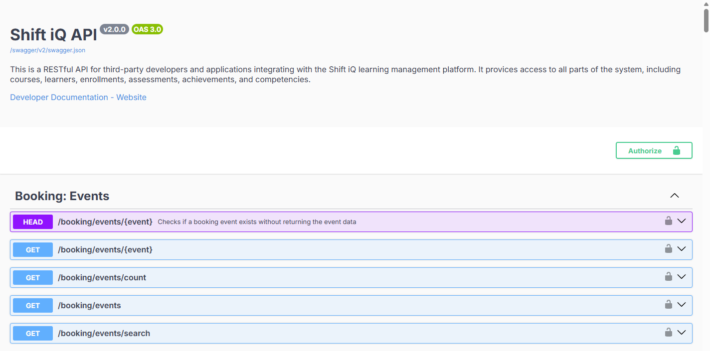

# API v2 introduction

Version 2 of the API is a more comprehensive programming interface, providing developers and integrators with access to every part of every subsystem throughout the platform.

!!! warning
    **Version 2 is a Beta release and is therefore subject to change.**

    We'll post updates as they become available. If you'd like to join our beta program, then please [contact our service and support team](mailto:support@cmds.app) to have your developer account enabled. We'd love to get your feedback.

## Authentication

For details on API keys, bearer tokens, and other authentication methods, see [Authentication](authentication.md).

Login, click your name at the top right, and click **My Profile**:

## OpenAPI specification

The API is described using the [OpenAPI Specification](https://github.com/OAI/OpenAPI-Specification) (OAS), a language-agnostic standard for documenting HTTP APIs. You can use the OAS definition to explore available endpoints, generate client code, and integrate the specification into your CI/CD pipeline.

The OAS for the CMDS API looks like this:

Browse the full specification via the API Reference link below, or download it as JSON for use in your own applications.

**API Reference**: [https://dev-api.cmds.app/v2/e01/swagger/](https://dev-api.cmds.app/v2/e01/swagger/)

