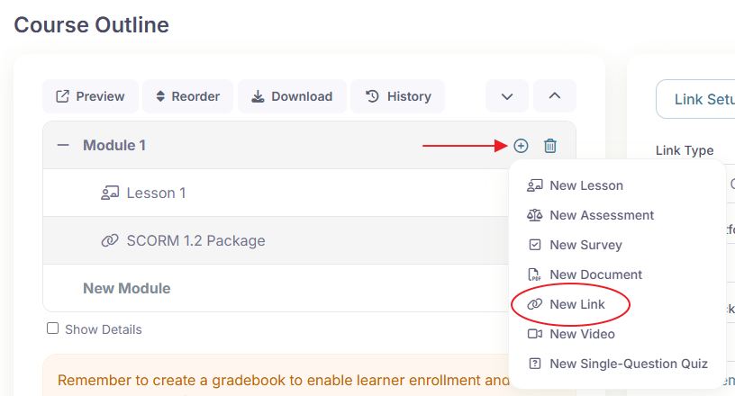
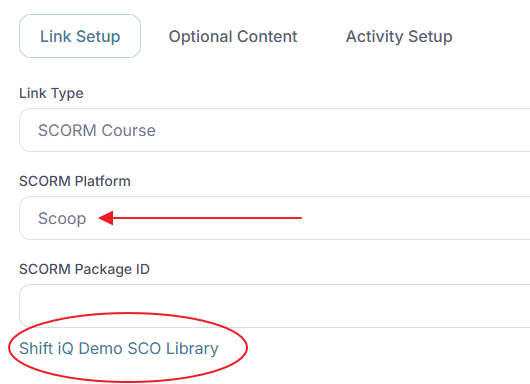
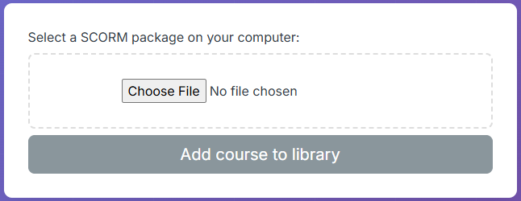
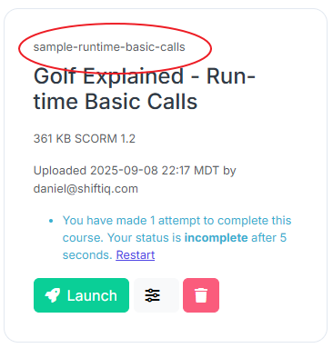
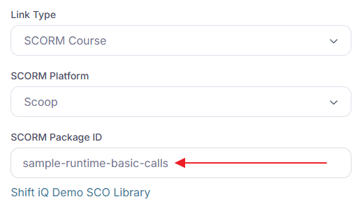
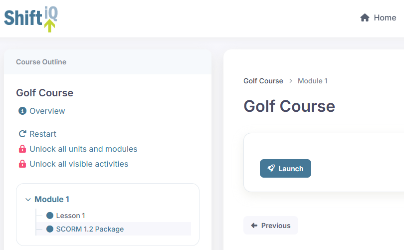

# Adding SCORM content to a course

Step-by-step instructions to add a SCORM package to a course activity.

Adding a SCORM package to a course in CMDS is a simple process.

## Step 1

Add a Link activity to a module in your course.

## Step 2

Select the option to use "Scoop" as your SCORM Platform.

If an SCO library is not already created for your organization, the system will create it automatically, and display a link to the library.

Click the link to open your SCO library.

## Step 3

Upload your SCORM package.

Click the button to choose a file on your computer, and click the button to add your SCORM package to your library.

The system will generate a SCORM package identifier for you automatically. It converts the name of your file to lowercase, and replaces non-alphanumeric characters to hyphens. This ensures the identifier is web-friendly. Copy this to your clipboard.

## Step 4

Paste the SCORM package identifier into the field labelled "SCORM Package ID".

## Step 5

Save your changes, preview the course in CMDS, and click the Launch button to confirm your content is displayed.

